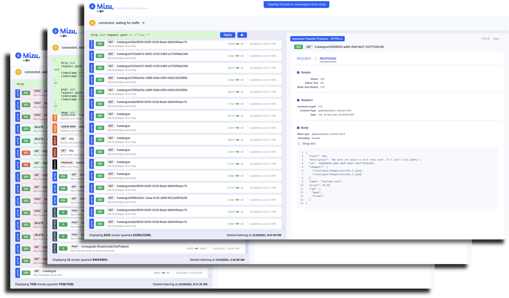

# The API Traffic Viewer for Kubernetes

A simple-yet-powerful API traffic viewer for Kubernetes to help you troubleshoot and debug your microservices. Think TCPDump and Chrome Dev Tools combined.



## Features

- Simple and powerful CLI
- Real time view of all HTTP requests, REST and gRPC API calls
- No installation or code instrumentation
- Works completely on premises (on-prem)

## Download

Download Mizu for your platform and operating system

### Latest Stable Release

* for MacOS - Intel 
```
curl -Lo mizu \
https://github.com/up9inc/mizu/releases/latest/download/mizu_darwin_amd64 \
&& chmod 755 mizu
```
 
* for Linux - Intel 64bit
```
curl -Lo mizu \
https://github.com/up9inc/mizu/releases/latest/download/mizu_linux_amd64 \
&& chmod 755 mizu
``` 

SHA256 checksums are available on the [Releases](https://github.com/up9inc/mizu/releases) page.

### Development (unstable) Build
Pick one from the [Releases](https://github.com/up9inc/mizu/releases) page.

## Prerequisites
1. Set `KUBECONFIG` environment variable to your Kubernetes configuration. If this is not set, Mizu assumes that configuration is at `${HOME}/.kube/config`
2. Mizu needs following permissions on your Kubernetes cluster to run

```yaml
- apiGroups:
  - ""
  resources:
  - pods
  verbs:
  - list
  - watch
  - create
  - delete
- apiGroups:
  - ""
  resources:
  - services
  verbs:
  - create
  - delete
- apiGroups:
  - apps
  resources:
  - daemonsets
  verbs:
  - create
  - patch
  - delete
- apiGroups:
  - ""
  resources:
  - namespaces
  verbs:
  - get
  - list
  - watch
  - create
  - delete
- apiGroups:
  - ""
  resources:
  - services/proxy
  verbs:
  - get
```

3. Optionally, for resolving traffic IP to Kubernetes service name, Mizu needs below permissions

```yaml
- apiGroups:
  - ""
  resources:
  - pods
  verbs:
  - get
  - list
  - watch
  - create
  - delete
- apiGroups:
  - ""
  resources:
  - services
  verbs:
  - get
  - list
  - watch
  - create
  - delete
- apiGroups:
  - apps
  resources:
  - daemonsets
  verbs:
  - create
  - patch
  - delete
- apiGroups:
  - ""
  resources:
  - namespaces
  verbs:
  - get
  - list
  - watch
  - create
  - delete
- apiGroups:
  - ""
  resources:
  - services/proxy
  verbs:
  - get
- apiGroups:
  - ""
  resources:
  - serviceaccounts
  verbs:
  - get
  - create
  - delete
- apiGroups:
  - rbac.authorization.k8s.io
  resources:
  - clusterroles
  verbs:
  - get
  - create
  - delete
- apiGroups:
  - rbac.authorization.k8s.io
  resources:
  - clusterrolebindings
  verbs:
  - get
  - create
  - delete
- apiGroups:
  - rbac.authorization.k8s.io
  resources:
  - roles
  verbs:
  - get
  - create
  - delete
- apiGroups:
  - rbac.authorization.k8s.io
  resources:
  - rolebindings
  verbs:
  - get
  - create
  - delete
- apiGroups:
  - apps
  - extensions
  resources:
  - pods
  verbs:
  - get
  - list
  - watch
- apiGroups:
  - apps
  - extensions
  resources:
  - services
  verbs:
  - get
  - list
  - watch
- apiGroups:
  - ""
  - apps
  - extensions
  resources:
  - endpoints
  verbs:
  - get
  - list
  - watch
```

4. Optionally, in order to use the policy rules validation feature, Mizu requires the following additional permissions:

```yaml
- apiGroups:
  - ""
  resources:
  - configmaps
  verbs:
  - get
  - create
  - delete
```

5. Alternatively, in order to restrict Mizu to one namespace only (by setting `agent.namespace` in the config file), Mizu needs the following permissions in that namespace:

```yaml
- apiGroups:
  - ""
  resources:
  - pods
  verbs:
  - get
  - list
  - watch
  - create
  - delete
- apiGroups:
  - ""
  resources:
  - services
  verbs:
  - get
  - create
  - delete
- apiGroups:
  - apps
  resources:
  - daemonsets
  verbs:
  - get
  - create
  - patch
  - delete
- apiGroups:
  - ""
  resources:
  - services/proxy
  verbs:
  - get
```

6. To restrict Mizu to one namespace while also resolving IPs, Mizu needs the following permissions in that namespace:

```yaml
- apiGroups:
  - ""
  resources:
  - pods
  verbs:
  - get
  - list
  - watch
  - create
  - delete
- apiGroups:
  - ""
  resources:
  - services
  verbs:
  - get
  - list
  - watch
  - create
  - delete
- apiGroups:
  - apps
  resources:
  - daemonsets
  verbs:
  - get
  - create
  - patch
  - delete
- apiGroups:
  - ""
  resources:
  - services/proxy
  verbs:
  - get
- apiGroups:
  - ""
  resources:
  - serviceaccounts
  verbs:
  - get
  - create
  - delete
- apiGroups:
  - rbac.authorization.k8s.io
  resources:
  - roles
  verbs:
  - get
  - create
  - delete
- apiGroups:
  - rbac.authorization.k8s.io
  resources:
  - rolebindings
  verbs:
  - get
  - create
  - delete
- apiGroups:
  - apps
  - extensions
  resources:
  - pods
  verbs:
  - get
  - list
  - watch
- apiGroups:
  - apps
  - extensions
  resources:
  - services
  verbs:
  - get
  - list
  - watch
- apiGroups:
  - ""
  - apps
  - extensions
  resources:
  - endpoints
  verbs:
  - get
  - list
  - watch
```

See `examples/roles` for example `clusterroles`. 

## How to Run

1. Find pods you'd like to tap to in your Kubernetes cluster
2. Run `mizu tap PODNAME` or `mizu tap REGEX` 
3. Open browser on `http://localhost:8899/mizu` **or** as instructed in the CLI .. 
4. Watch the API traffic flowing ..
5. Type ^C to stop

## Examples

Run `mizu help` for usage options


To tap specific pod - 
``` 
 $ kubectl get pods 
 NAME                            READY   STATUS    RESTARTS   AGE
 front-end-649fc5fd6-kqbtn       2/2     Running   0          7m
 ..

 $ mizu tap front-end-649fc5fd6-kqbtn
 +front-end-649fc5fd6-kqbtn
 Web interface is now available at http://localhost:8899
 ^C
```

To tap multiple pods using regex - 
``` 
 $ kubectl get pods 
 NAME                            READY   STATUS    RESTARTS   AGE
 carts-66c77f5fbb-fq65r          2/2     Running   0          20m
 catalogue-5f4cb7cf5-7zrmn       2/2     Running   0          20m
 front-end-649fc5fd6-kqbtn       2/2     Running   0          20m
 ..

 $ mizu tap "^ca.*"
 +carts-66c77f5fbb-fq65r
 +catalogue-5f4cb7cf5-7zrmn
 Web interface is now available at http://localhost:8899
 ^C
```

## Configuration

Mizu can work with config file which should be stored in ${HOME}/.mizu/config.yaml (macOS: ~/.mizu/config.yaml) <br />
In case no config file found, defaults will be used. <br />
In case of partial configuration defined, all other fields will be used with defaults. <br />
You can always override the defaults or config file with CLI flags.

To get the default config params run `mizu config` <br />
To generate a new config file with default values use `mizu config -r`

Mizu has several undocumented flags which can be set by using --set flag (e.g., `mizu tap --set dump-logs=true`)
* **mizu-resources-namespace**: Type - String, See [Namespace-Restricted Mode](#namespace-restricted-mode)
* **telemetry**: Type - Boolean, Reports telemetry
* **dump-logs**: Type - Boolean, At the end of the execution it creates a zip file with logs (in .mizu folder)
* **kube-config-path**: Type - String, Setting the path to kube config (which isn't in standard path)

## Advanced Usage

### Namespace-Restricted Mode

Some users have permission to only manage resources in one particular namespace assigned to them.
By default `mizu tap` creates a new namespace `mizu` for all of its Kubernetes resources. In order to instead install
Mizu in an existing namespace, set the `mizu-resources-namespace` config option.

If `mizu-resources-namespace` is set to a value other than the default `mizu`, Mizu will operate in a
Namespace-Restricted mode. It will only tap pods in `mizu-resources-namespace`. This way Mizu only requires permissions
to the namespace set by `mizu-resources-namespace`. The user must set the tapped namespace to the same namespace by
using the `--namespace` flag or by setting `tap.namespaces` in the config file.

Setting `mizu-resources-namespace=mizu` resets Mizu to its default behavior.
