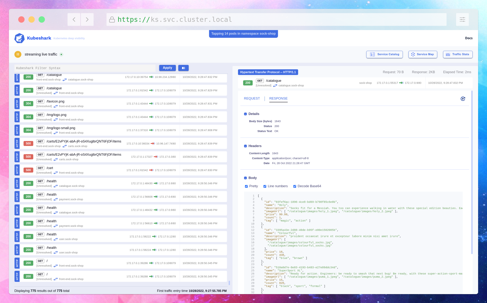

<p align="center">
  
</p>

<p align="center">
    <a href="https://github.com/kubeshark/kubeshark/blob/main/LICENSE">
        
    </a>
    <a href="https://github.com/kubeshark/kubeshark/releases/latest">
        
    </a>
    <a href="https://hub.docker.com/r/kubeshark/kubeshark">
      
    </a>
    <a href="https://hub.docker.com/r/kubeshark/kubeshark">
      
    </a>
    <a href="https://join.slack.com/t/mertyildiran/shared_invite/zt-1k3sybpq9-uAhFkuPJiJftKniqrGHGhg">
      
    </a>
</p>

Kubeshark is an **observability and monitoring tool for** [**Kubernetes**](https://kubernetes.io/), enabling **dynamic analysis** of the microservices, detecting **anomalies** and **triggering functions** when certain patterns appear in runtime.

Think of Kubeshark as a **Kubernetes-aware** combination of [**Wireshark**](https://www.wireshark.org/), [**BPF Compiler Collection (BCC) tools**](https://github.com/iovisor/bcc) and beyond.



## Quickstart

Installing Kubeshark can't be any easier. Either choose the right binary, download and use directly from [the releases section](https://github.com/kubeshark/kubeshark/releases/), or use a shell script to download the right binary for your operating system and CPU architecture:

```shell
sh <(curl -Ls https://kubeshark.co/install)
```

## Deploy

Once you have the Kubeshark CLI installed on your system, run the command below to deploy the Kubeshark container into your Kubernetes cluster.

```shell
kubeshark tap
```
### Troubleshooting Installation
If something doesn't work or simply to play it safe prior to installing, make sure that:

> Kubeshark images are hosted on Docker Hub. Make sure you have access to https://hub.docker.com/

> Make sure `kubeshark` executable in your `PATH`.

### Select Pods

#### Monitoring a Specific Pod:

```shell
kubeshark tap catalogue-b87b45784-sxc8q
```

#### Monitoring a Set of Pods Using Regex:

```shell
kubeshark tap "(catalo*|front-end*)"
```

### Specify the Namespace

By default, Kubeshark is deployed into the `default` namespace.
To specify a different namespace:

```
kubeshark tap -n sock-shop
```

### Specify All Namespaces

The default deployment strategy of Kubeshark waits for the new pods
to be created. To simply deploy to all existing namespaces run:

```
kubeshark tap -A
```

## Documentation

Visit our documentation website: [docs.kubeshark.co](https://docs.kubeshark.co)

The documentation resources are open-source and can be found on GitHub: [kubeshark/docs](https://github.com/kubeshark/docs)

## Contributing

We ❤️ pull requests! See [CONTRIBUTING.md](docs/CONTRIBUTING.md) for the contribution guide.

## Code of Conduct

This project is for everyone. We ask that our users and contributors take a few minutes to review our [Code of Conduct](docs/CODE_OF_CONDUCT.md).
