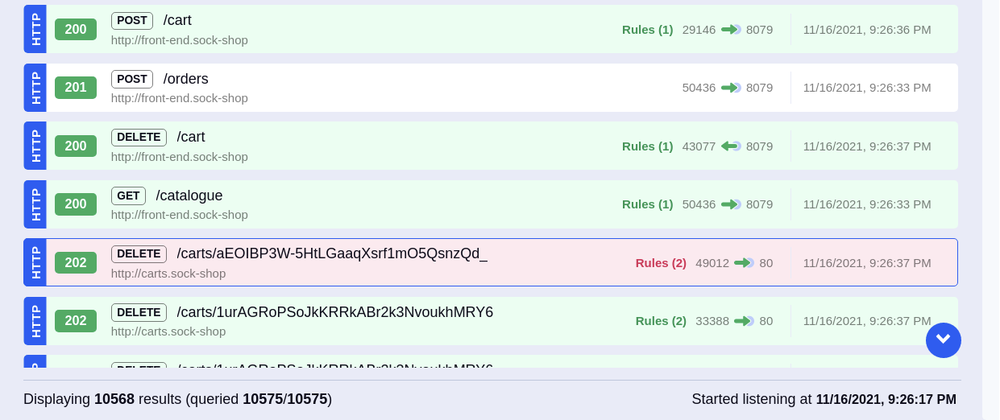
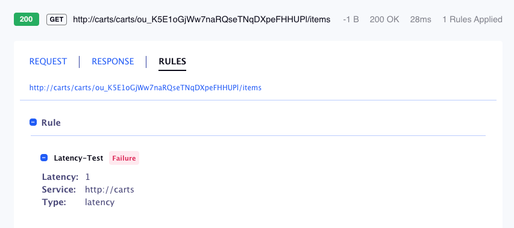

# Traffic validation rules

This feature allows you to define set of simple rules, and test the traffic against them.
Such validation may test response for specific JSON fields, headers, etc.

## Examples

Example 1: HTTP request (REST API call) that didn't pass validation is highlighted in red



- - -

Example 2: Details pane shows the validation rule details and whether it passed or failed




## How to use

To use this feature - create simple rules file (see details below) and pass this file as parameter to `mizu tap` command. For example, if rules are stored in file named `rules.yaml` — run the following command:

```shell
mizu tap --traffic-validation-file rules.yaml
```


## Rules file structure

The structure of the traffic-validation-file is:

* `name`: string, name of the rule
* `type`: string, type of the rule, must be `json` or `header` or `latency`
* `key`: string, [jsonpath](https://code.google.com/archive/p/jsonpath/wikis/Javascript.wiki) used only in `json` or `header` type
* `value`: string, [regex](https://developer.mozilla.org/en-US/docs/Web/JavaScript/Guide/Regular_Expressions) used only in `json` or `header` type
* `service`: string, [regex](https://developer.mozilla.org/en-US/docs/Web/JavaScript/Guide/Regular_Expressions) service name to filter
* `path`: string, [regex](https://developer.mozilla.org/en-US/docs/Web/JavaScript/Guide/Regular_Expressions) URL path to filter
* `latency`: integer, time in ms of the expected latency.


### For example:

```yaml
rules:
- name: holy-in-name-property
  type: json
  key: "$.name"
  value: "Holy"
  service: "catalogue.*"
  path: "catalogue.*"
- name: content-length-header
  type: header
  key: "Content-Le.*"
  value: "(\\d+(?:\\.\\d+)?)"
- name: latency-test
  type: latency
  latency: 1
  service: "carts.*"
```


### Explanation:

* First rule `holy-in-name-property`:

  > This rule will be applied to all request made to `catalogue.*` services with `catalogue.*` on the URL path with a json response containing a `$.name` field. If the value of `$.name` is `Holy` than is marked as success, marked as failure otherwise.

* Second rule `content-length-header`:

  > This rule will be applied to all request that has `Content-Le.*` on header. If the value of `Content-Le.*` is `(\\d+(?:\\.\\d+)?)` (number), will be marked as success, marked as failure otherwise.

* Third rule `latency-test`:

  > This rule will be applied to all request made to `carts.*` services. If the latency of the response is greater than `1ms` will be marked as failure, marked as success otherwise.
